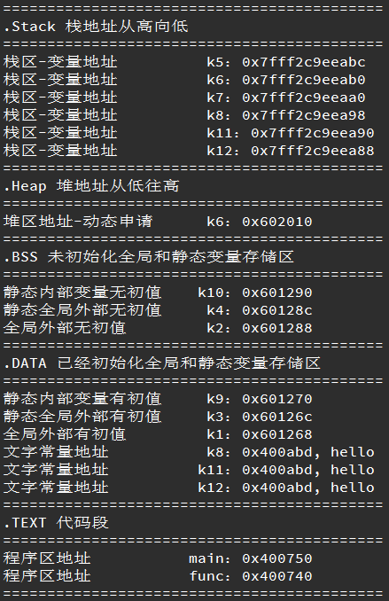

## static关键字
　　static 是C/C++中很常用的修饰符，它被用来控制变量的存储方式和可见性。

### static的引入
　　我们知道在函数内部定义的变量，当程序执行到它的定义处时，编译器为它在栈上分配空间，函数在栈上分配的空间在此函数执行结束时会释放掉，这样就产生了一个问题: 如果想将函数中此变量的值保存至下一次调用时，如何实现？ 最容易想到的方法是定义为全局的变量，但定义一个全局变量有许多缺点，最明显的缺点是破坏了此变量的访问范围（使得在此函数中定义的变量，不仅仅只受此函数控制）。static关键字则可以很好的解决这个问题。

另外，在C++中，需要一个数据对象为整个类而非某个对象服务,同时又力求不破坏类的封装性,即要求此成员隐藏在类的内部，对外不可见时，可将其定义为静态数据。

### 静态数据的存储
　　全局（静态）存储区：分为DATA段和BSS段。DATA段（全局初始化区）存放初始化的全局变量和静态变量；BSS段（全局未初始化区）存放未初始化的全局变量和静态变量。程序运行结束时自动释放。其中BBS段在程序执行之前会被系统自动清0，所以未初始化的全局变量和静态变量在程序执行之前已经为0。存储在静态数据区的变量会在程序刚开始运行时就完成初始化，也是唯一的一次初始化。

在C++中static的内部实现机制：静态数据成员要在程序一开始运行时就必须存在。因为函数在程序运行中被调用，所以静态数据成员不能在任何函数内分配空间和初始化。
       这样，它的空间分配有三个可能的地方，一是作为类的外部接口的头文件，那里有类声明；二是类定义的内部实现，那里有类的成员函数定义；三是应用程序的main()函数前的全局数据声明和定义处。
      静态数据成员要实际地分配空间，故不能在类的声明中定义（只能声明数据成员）。类声明只声明一个类的“尺寸和规格”，并不进行实际的内存分配，所以在类声明中写成定义是错误的。它也不能在头文件中类声明的外部定义，因为那会造成在多个使用该类的源文件中，对其重复定义。
      static被引入以告知编译器，将变量存储在程序的静态存储区而非栈上空间，静态数据成员按定义出现的先后顺序依次初始化，注意静态成员嵌套时，要保证所嵌套的成员已经初始化了。消除时的顺序是初始化的反顺序。
优势：可以节省内存，因为它是所有对象所公有的，因此，对多个对象来说，静态数据成员只存储一处，供所有对象共用。静态数据成员的值对每个对象都是一样，但它的值是可以更新的。只要对静态数据成员的值更新一次，保证所有对象存取更新后的相同的值，这样可以提高时间效率。

## 在C/C++中static的作用
### 总的来说：
（1）在修饰变量的时候，static修饰的静态局部变量只执行初始化一次，而且延长了局部变量的生命周期，直到程序运行结束以后才释放。
（2）static修饰全局变量的时候，这个全局变量只能在本文件中访问，不能在其它文件中访问，即便是extern外部声明也不可以。
（3）static修饰一个函数，则这个函数的只能在本文件中调用，不能被其他文件调用。Static修饰的变量存放在全局数据区的静态变量区，包括全局静态变量和局部静态变量，都在全局数据区分配内存。初始化的时候自动初始化为0。
（4）不想被释放的时候，可以使用static修饰。比如修饰函数中存放在栈空间的数组。如果不想让这个数组在函数调用结束释放可以使用static修饰。
（5）考虑到数据安全性（当程序想要使用全局变量的时候应该先考虑使用static）。

### 静态变量与普通变量
静态全局变量有以下特点：
（1）静态变量都在全局数据区分配内存，包括后面将要提到的静态局部变量;
（2）未经初始化的静态全局变量会被程序自动初始化为0（在函数体内声明的自动变量的值是随机的，除非它被显式初始化，而在函数体外被声明的自动变量也会被初始化为0）；
（3）静态全局变量在声明它的整个文件都是可见的，而在文件之外是不可见的。
优点：静态全局变量不能被其它文件所用；其它文件中可以定义相同名字的变量，不会发生冲突。
（1）全局变量和全局静态变量的区别

1）全局变量是不显式用static修饰的全局变量，全局变量默认是有外部链接性的，作用域是整个工程，在一个文件内定义的全局变量，在另一个文件中，通过extern 全局变量名的声明，就可以使用全局变量。
2）全局静态变量是显式用static修饰的全局变量，作用域是声明此变量所在的文件，其他的文件即使用extern声明也不能使用。
### 静态局部变量有以下特点：
（1）该变量在全局数据区分配内存；
（2）静态局部变量在程序执行到该对象的声明处时被首次初始化，即以后的函数调用不再进行初始化；
（3）静态局部变量一般在声明处初始化，如果没有显式初始化，会被程序自动初始化为0；
（4）它始终驻留在全局数据区，直到程序运行结束。但其作用域为局部作用域，当定义它的函数或语句块结束时，其作用域随之结束。
　　一般程序把新产生的动态数据存放在堆区，函数内部的自动变量存放在栈区。自动变量一般会随着函数的退出而释放空间，静态数据（即使是函数内部的静态局部变量）也存放在全局数据区。全局数据区的数据并不会因为函数的退出而释放空间。

``` CPP
	#include <stdio.h>  
	#include <stdlib.h>  
	int k1 = 1;
	int k2; 
	static int k3 = 2;
	static int k4; 
	
	void hello_world(){
		printf("hello world \n");
	}
	
	int main()
	{
		int k5 = 1;
		char* k6; 
		char k7[10] = "hello";
		char* k8 = "hello";
		const char* k11 = "hello";
		char* const k12 = "hello";                                                                           
		k6 = (char *)malloc(100);
		static int k9 = 2;
		static int k10;
		printf("===========================================\n");
		printf(".Stack 栈地址从高向低\n");
		printf("===========================================\n");
		printf("栈区-变量地址          k5：%p\n", &k5);
		printf("栈区-变量地址          k6：%p\n", &k6);
		printf("栈区-变量地址          k7：%p\n", &k7);
		printf("栈区-变量地址          k8：%p\n", &k8);
		printf("栈区-变量地址          k11：%p\n", &k11);
		printf("栈区-变量地址          k12：%p\n", &k12);
		printf("===========================================\n");
		printf(".Heap 堆地址从低往高\n");
		printf("===========================================\n");
		printf("堆区地址-动态申请      k6：%p\n", k6);
		printf("===========================================\n");
		printf(".BSS 未初始化全局和静态变量存储区\n");
		printf("===========================================\n");
		printf("静态内部变量无初值    k10：%p\n", &k10);
		printf("静态全局外部无初值     k4：%p\n", &k4);
		printf("全局外部无初值         k2：%p\n", &k2);
		printf("===========================================\n");
		printf(".DATA 已经初始化全局和静态变量存储区\n");
		printf("===========================================\n");
		printf("静态内部变量有初值     k9：%p\n", &k9);
		printf("静态全局外部有初值     k3：%p\n", &k3);
		printf("全局外部有初值         k1：%p\n", &k1);
		printf("文字常量地址           k8：%p, %s\n", k8, k8);
		printf("文字常量地址          k11：%p, %s\n", k11, k11);
		printf("文字常量地址          k12：%p, %s\n", k12, k12);
		printf("===========================================\n");
		printf(".TEXT 代码段\n");
		printf("===========================================\n");
		printf("程序区地址           main：%p\n", &main);
		printf("程序区地址           func：%p\n", &hello_world);
		printf("===========================================\n");
	
		free(k6);
		return 0;
	}
```

输出结果：


### 特别的，在C++中：
static关键字最基本的用法是：

1、被static修饰的变量属于类变量，可以通过类名.变量名直接引用，而不需要new出一个类来

2、被static修饰的方法属于类方法，可以通过类名.方法名直接引用，而不需要new出一个类来

被static修饰的变量、被static修饰的方法统一属于类的静态资源，是类实例之间共享的，换言之，一处变、处处变。

　　在C++中，静态成员是属于整个类的而不是某个对象，静态成员变量只存储一份供所有对象共用。所以在所有对象中都可以共享它。使用静态成员变量实现多个对象之间的数据共享不会破坏隐藏的原则，保证了安全性还可以节省内存。
静态成员的定义或声明要加个关键static。静态成员可以通过双冒号来使用即<类名>::<静态成员名>。
思考总结：静态资源属于类，但是是独立于类存在的。从J类的加载机制的角度讲，静态资源是类初始化的时候加载的，而非静态资源是类实例化对象的时候加载的。 类的初始化早于类实例化对象，比如Class.forName(“xxx”)方法，就是初始化了一个类，但是并没有实例化对象，只是加载这个类的静态资源罢 了。所以对于静态资源来说，它是不可能知道一个类中有哪些非静态资源的；但是对于非静态资源来说就不一样了，由于它是实例化对象出来之后产生的，因此属于类的这些东西它都能认识。所以上面的几个问题答案就很明确了：

1）静态方法能不能引用非静态资源？不能，实例化对象的时候才会产生的东西，对于初始化后就存在的静态资源来说，根本不认识它。

2）静态方法里面能不能引用静态资源？可以，因为都是类初始化的时候加载的，大家相互都认识。

3）非静态方法里面能不能引用静态资源？可以，非静态方法就是实例方法，那是实例化对象之后才产生的，那么属于类的内容它都认识。

　　（static修饰类：这个用得相对比前面的用法少多了，static一般情况下来说是不可以修饰类的， 如果static要修饰一个类，说明这个类是一个静态内部类（注意static只能修饰一个内部类），也就是匿名内部类。像线程池 ThreadPoolExecutor中的四种拒绝机制CallerRunsPolicy、AbortPolicy、DiscardPolicy、 DiscardOldestPolicy就是静态内部类。静态内部类相关内容会在写内部类的时候专门讲到。）

### 总结：
（1）静态成员函数中不能调用非静态成员。

（2）非静态成员函数中可以调用静态成员。因为静态成员属于类本身，在类的对象产生之前就已经存在了，所以在非静态成员函数中是可以调用静态成员的。

（3）静态成员变量使用前必须先初始化(如int MyClass::m_nNumber = 0;)，否则会在linker时出错。

参考：http://blog.csdn.net/morewindows/article/details/6721430

 一般总结：在类中，static可以用来修饰静态数据成员和静态成员方法 
静态数据成员 
（1）静态数据成员可以实现多个对象之间的数据共享，它是类的所有对象的共享成员，它在内存中只占一份空间，如果改变它的值，则各对象中这个数据成员的值都被改变。 
（2）静态数据成员是在程序开始运行时被分配空间，到程序结束之后才释放，只要类中指定了静态数据成员，即使不定义对象，也会为静态数据成员分配空间。 
（3）静态数据成员可以被初始化，但是只能在类体外进行初始化，若未对静态数据成员赋初值，则编译器会自动为其初始化为0 
（4）静态数据成员既可以通过对象名引用，也可以通过类名引用。

静态成员函数 
（1）静态成员函数和静态数据成员一样，他们都属于类的静态成员，而不是对象成员。 
（2）非静态成员函数有this指针，而静态成员函数没有this指针。 
（3）静态成员函数主要用来方位静态数据成员而不能访问非静态成员。

## 简言之
1. 修饰普通变量，修改变量的存储区域和生命周期，使变量存储在静态区，在 main函数运行前就分配了空间，如果有初始值就用初始值初始化它，如果没有初始值系统用默认值初始化它。
2. 修饰普通函数，表明函数的作用范围，仅在定义该函数的文件内才能使用。在多人开发项目时，为了防止与他人命令函数重名，可以将函数定位为 static。
3. 修饰成员变量，修饰成员变量使所有的对象只保存一个该变量，而且不需要生成对象就可以访问该成员。
4. 修饰成员函数，修饰成员函数使得不需要生成对象就可以访问该函数，但是在 static 函数内不能访问非静态成员