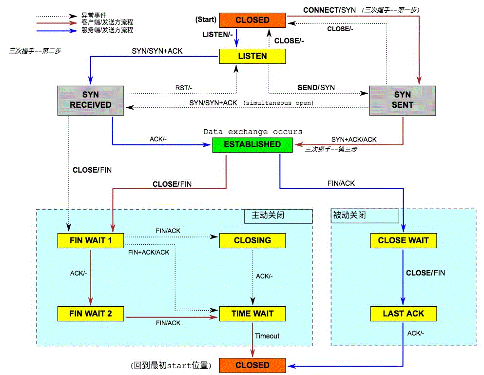

全部11种状态
1. 客户端独有的：（1）SYN_SENT （2）FIN_WAIT1 （3）FIN_WAIT2 （4）CLOSING （5）TIME_WAIT 
2. 服务器独有的：（1）LISTEN （2）SYN_RCVD （3）CLOSE_WAIT （4）LAST_ACK 
3. 共有的：（1）CLOSED （2）ESTABLISHED 

各个状态的意义如下： 
(1)  LISTEN - 侦听来自远方TCP端口的连接请求； 
(2)  SYN-SENT -在发送连接请求后等待匹配的连接请求； 
(3)  SYN-RECEIVED - 在收到和发送一个连接请求后等待对连接请求的确认； 
(4)  ESTABLISHED- 代表一个打开的连接，数据可以传送给用户； 
(5)  FIN-WAIT-1 - 等待远程TCP的连接中断请求，或先前的连接中断请求的确认；
(6)  FIN-WAIT-2 - 从远程TCP等待连接中断请求； 
(7)  CLOSE-WAIT - 等待从本地用户发来的连接中断请求； 
(8)  CLOSING -等待远程TCP对连接中断的确认； 
(9)  LAST-ACK - 等待原来发向远程TCP的连接中断请求的确认； 
(10) TIME-WAIT -等待足够的时间以确保远程TCP接收到连接中断请求的确认； 
(11) CLOSED - 没有任何连接状态；
     

## 1. TCP连接建立
### 1.1 过程
（1）客户 端发送一个带SYN标志的TCP报文到服务器。这是三次握手过程中的报文1。
（2）服务器端回应客户端的，这是三次握手中的第2个报文，这个报文同时带ACK标志和SYN标 志。因此它表示对刚才客户端SYN报文的回应；同时又标志SYN给客户端，询问客户端是否准备好进行数据通 讯。
（3）客户必须再次回应服务段一个ACK报文，这是报文段3。
### 1.2 为什么需要三次
本质上是为了连接双方交换 ISN（Inital Sequence Number），另外 TCP 是全双工的协议，所以每次 SYN，都需要有对应的 ACK。加上服务端的 ACK 和 SYN 是在同一个包中，也就形成了 3 次握手。

## 2. TCP连接断开
### 2.1 过程 
（1）客户端进程主动向服务端发出连接释放请求报文，并停止发送数据，主动关闭TCP连接。释放连接报文段中控制为FIN=1，序列号为seq=i，发送该报文段后客户端进入FIN_WAIT_1（终止等待１）状态，等待服务器确认。这是TCP连接释放的第一次挥手。
（2）服务器收到连接释放请求报文段后即发出确认释放连接的报文段，该报文段中控制位ACK=1，确认号为ack=i+1，然后服务器进入CLOSE_WAIT（关闭等待）状态。此时TCP处于半关闭状态，即客户端已经不向服务器发送数据，但服务器仍可向客户端发送数据。这是TCP连接释放的第二次挥手。
（3）客户端收到服务器的确认信息后，就进入了FIN_WAIT_2（终止等待２）状态，等待服务器发出连接释放请求报文段，若没有数据需要传输，服务器被动向客户端发出链接释放请求报文段，报文段中控制位FIN=1，序列号seq=j，此时服务器进入LAST_ACK（最后确认）状态，等待客户端的确认应答，这是TCP连接释放的第三次挥手。
（4）客户端收到服务器的连接释放请求后，必须对此发出确认。确认报文段中控制位ACK＝１，确认应答号ack=j+1，客户端发出确认应答消息后进入TIME_WAIT（时间等待）状态。在这段时间内TCP连接并没有释放，必须等待２MSL时间后，客户端才进入CLOSED状态。服务器收到客户端的确认应答后，就进入CLOSED状态。直到客户端和服务器都进入了CLOSED状态后，连接就完全释放了，这是TCP连接释放的第四此挥手。

### .2 为什么断开连接需要4次挥手 
因为当处于LISTEN状态的服务器端收到来自客户端的SYN报文(客户端希望新建一个TCP连接)时，它可以把ACK(确认应答)和SYN(同步序号)放在同一个报文里来发送给客户端。但在关闭TCP连接时，当收到对方的FIN报文时，对方仅仅表示对方已经没有数据发送给你了，但是你自己可能还有数据需要发送给对方，则等你发送完剩余的数据给对方之后，再发送FIN报文给对方来表示你数据已经发送完毕，并请求关闭连接，所以通常情况下，这里的ACK报文和FIN报文都是分开发送的。

### 2.3 CLOSE_WAIT 
CLOSE_WAIT的状态位于向对方确认FIN之后，向对方发送FIN之前，这段时间由于对方已经发送了FIN，也就表示不会再收到数据，但是这并不表示自己没有数据要发，毕竟只有在发送了FIN之后，才表示发送完毕。所以，CLOSE_WAIT这段时间主要的工作就是给对方发送必要的数据，对自己的数据进行收尾，所有工作结束之后，调用close()，发送FIN，等待LAST_ACK

### 2.4 TIME_WAIT的作用 
（1）实现终止TCP全双工连接的可靠性：假如LAST-ACK丢失，对方重发，但是自己已经关闭连接，那么会返回一个RST包，对放会将其解释为错误，从而无法正常关闭。也就是说，TIME_WAIT的作用之一就是解决LAST-ACK可能丢包的情况，因为在有些网络不好的情况下，不得不重发LAST-ACK
（2）允许老的网络分组在网络中消逝：2MSL的时间足够让所有的FIN数据在网络中消失，如果不等待，并立即开始一个新的连接，有可能出现老FIN关闭了新连接的情况，因为在IP和端口一直的情况下，很难区分一个数据包是属于哪一次连接的。

### 2.5 等待2MSL时间 
（1）TIME_WAIT确保有足够的时间让对端收到了ACK，如果被动关闭的那方没有收到ACK，就会出发被动端重发FIN。因为最后一次确认应答ACK报文段很有可能丢失，因而使被动关闭方处在LAST_ACK，此时被动关闭方会重复这个FIN+ACK报文段，在这等待的2MSL时间被主动关闭方重新收到这个被动关闭方重发的FIN+ACK报文段，因此，主动关闭方会重新发送确认应答信息，从而重新启动2MSL计时器，直到通信双方都进入CLOSED状态。如果主动关闭方在TIME_WAIT状态不等待一段时间就直接释放连接并进入CLOSED状态，那么主动关闭方无法收到来自被动关闭方重发的FIN+ACK报文段，也就不会再发送一次确认ACK报文段，因此被动关闭方就无法正常地进入CLOSED状态。
（2）有足够的时间让这个连接不会跟后面的连接混在一起。防止已失效的请求连接出现在本连接中。在连接处于2MSL等待时，任何迟到的报文段将被丢弃，因为处于2MSL等待的，由该插口(插口是IP端口对的意思，socket)定义的连接在这段时间内将不能被再用，这样就可以使下一个新的连接中不会出现这种旧的连接以前延迟的报文段。